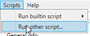
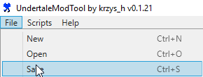

# SuperLedgeHATE
DeltaHATE modified to work with Super Ledgehop Double Laser

## how to do i to how to use how do i to
download [UndertaleModTool](https://github.com/krzys-h/UndertaleModTool/releases)  
[download the script](https://github.com/geniiii/SuperLedgeHATE/releases)  
backup the game's original `data.win` somewhere   
open the game's `data.win` in UndertaleModTool  
  
select the script and wait for it to finish  
  
overwrite the game's original `data.win`  
run the game

## how do seeds work
(./ being the UndertaleModTool directory)  
`./seed` is read and used instead of random generation if it exists and is not 0 or empty  
`./lastSeed` is written at the end of the script, simply contains the last seed used

## other stuff
there's a possibility this might actually somewhat work with some other games with similar structure, although save files will likely be broken which can lead to crashes (as it does in Super Ledgehop)
